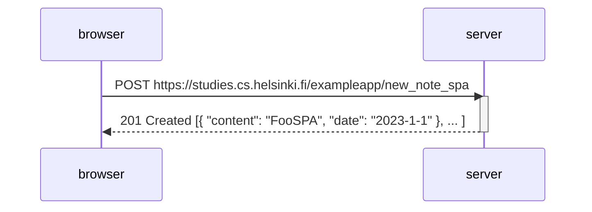

A diagram depicting the behavior when a user creates a new note on the single-page version
of the note app https://studies.cs.helsinki.fi/exampleapp/spa by writing something into the text field
and submitting it via the submit button.

After the first HTTP Request to /new_note_spa, the browser is not redirecting like it would for the none SPA note version
and the requests that were caused because of the redirect are no longer which brings the amount down from 5 to 1 request in total.

